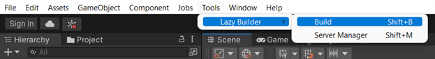
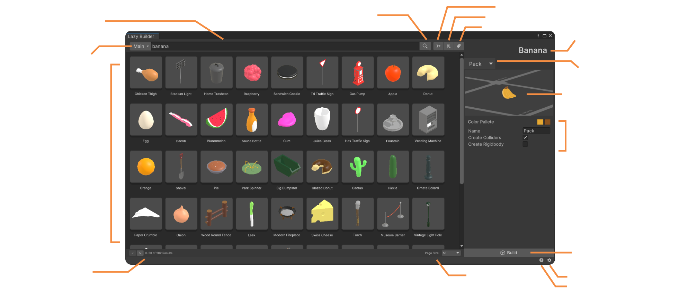
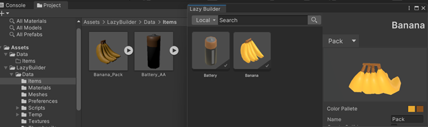
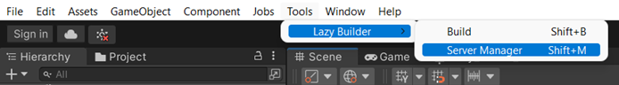
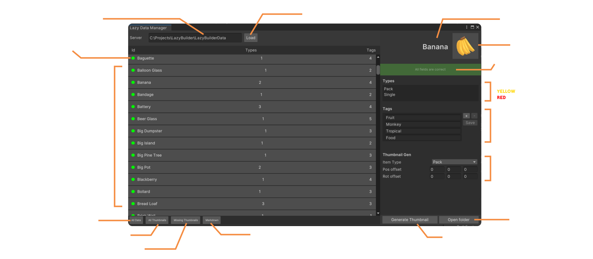

## Builder Window 🛠
In order to start building assets into your game, open the “Builder Window” located in **Tools > Lazy Builder > Build** or simply press **Shift+B** 

As you select the above option, the Builder window will appear. Here you can browse for **Items** from each **Server**’s collection, select an **Item Type**, change its properties, and build it.

The built/fetched items can be found in the **“Local”** server option or simply in the project path **Lazy Builder > Data > Items**

## Super Lightweight 🏋️
Since the tool by default does not contain any 3D assets its whole source occupies less than 5Mb. 

 

## Manager Window 🔩
In order to start building open the “Builder Window” located in **Tools > Lazy Builder > Build** or simply press **Shift+M**

As you select the above option, the Manager window will appear. Here you can load a local **Server** and access all its **Items**, where you can check the overall Item status, display the **Item Types**, display/edit search **Tags**, generate **Thumbnails** of each **Item**. There are also options to automatically generate the **data.json** and the **AssetList.md** file, based on the current file/folder structure.

