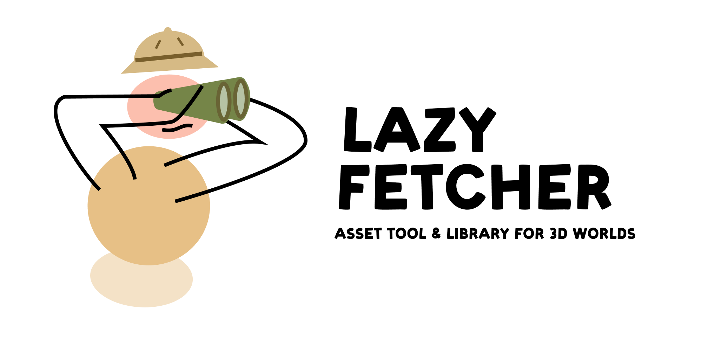

## Build your desired levels at an instant of a click! 🛠️
Lazy Builder is a Tool & Library designed to simplify the construction of 3D environments. 

 

## Super Lightweight 🏋️
Since the tool by default does not contain any 3D assets its whole source occupies less than 5Mb. 

 

## Make use of the official Library 📦
The Lazy Builder comes with a main official library that has hundreds of CC0 Assets to help you build/prototype your levels ([more info](https://github.com/wafflesgama/LazyBuilderLibrary)).   

 

## Create & Add your Custom Libraries 🖋️
The tool supports the addition of custom libraries (local or remote) to expand this collective open-source library or to quickly access your private asset collection. 
It has a dedicated window to help you manage & configure the library's data structure (local only).

 

## How does it actually work? ⚙️
 The tool was designed to use an agnostic fetching service that reads the list of available items (**data.json**) and displays & organizes them based on their **_ItemId_** & **_ItemTypeId_** properties. As you select each Item the fetching works by following the established path (./content/**_ItemId_**/**_ItemId_**_**_ItemTypeId_**.fbx)

| Fetching Service   | In Version | Additional Info             |
|--------------------|:----------:|----------------------------:|
| Github             | 1.00       | Public repositories only    |
| Local              | 1.00       | Tested on Windows OS        |

 

## Installation ⤵️
Available in the [Unity Asset Store](https://assetstore.unity.com/) or 
Import manually the .unitypackage in the [Releases Section](https://github.com/wafflesgama/LazyBuilder/releases) 

 

## Support & Contribute ☕
If you found out this tool useful and/or want to help this project continue its development you can [buy me a coffee](https://www.buymeacoffee.com/guilhermeGama)!

    

## Contribute 🧑‍💻  
If you spotted a bug, need a feature or have an awesome suggestion you can always create a github issue, fork it & merge request or simply contact me directly via e-mail or twitter. If you want to be a part of this project and contribute to it feel free to do so!

 

## Licensing
The Lazy ecosystem is licensed under [GNU GPLv3](./LICENSE) which lets people do almost anything they want with it, except distributing closed source versions. 
Crediting is not required but is kindly appreciated 🤗
